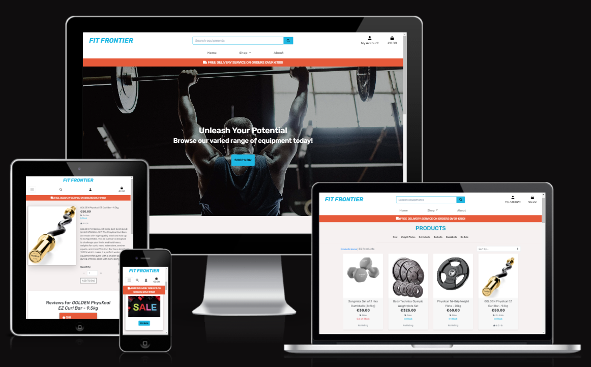

<h1 style="text-align: center;">Fit Frontier</h1>

Welcome to Fit Frontier. A full stack e-commerce website.

This project is created as part of my fifth and final project for a Diploma in Software Development with [Code Institue](https://codeinstitute.net/ie/).

[View the live project here.](https://fit-frontier-d971762c041b.herokuapp.com/)

<h2 style="text-align: center;"></h2>

# **Table of Contents**
- [**User Experience**](#user-experience-ux)
	- [Overview](#overview)
	- [Main Site Goals](#main-site-goals)
	- [User Stories](#user-stories)
	- [Design]()
    - [Features](#features)
	- [Wireframes](#wireframes)
	- [DB Schema](#database-schema)
- [**Technologies Used**](#technologies-used)
- [**Testing**](#testing)
- [**SEO**](#search-engine-optimization-seo--social-media-marketing)
- [**Deployment**](#deployment)
- [**Credits & Acknowledgements**](#credits)

## User Experience (UX)

- ### Business Model

	Fit Frontier is a Business to Business(B2B) & Business to Consumer(B2C) e-commerce site. The site's target audience is to provide high quality gym equipments for anyone looking to get fit; whether it be a business for their fitness facility or for the public to use in their own private gym garage or their home.

- #### Overview:
    Fit Frontier is an e-commerce platform specializing in the sale of gym equipment, including dumbbells, barbells, kettlebells, and weight plates. Our business model caters to both individual consumers (B2C) and businesses (B2B) looking to purchase high-quality fitness equipment. We aim to provide a seamless online shopping experience, offering a wide range of fitness products while prioritizing convenience, affordability, and customer satisfaction.

	<strong>You can test the payment functionality by using the following details in the checkout page: </strong>
		
		- Card Number: 4242 4242 4242 4242
		- Expiry Date: Any future date formatted to MM/YY
		- CVN: Any 3 digit number
		- Postal Code: Any 5 digits

- #### Main site Goals
	- Showcase all available products.
	- To provide customers with up-to-date information regarding the business through the use of email subscription.
	- To provide users multiple ways of getting in touch with the business by way of contact number and email address.
	- To provide users and customers more information about the business by way of social media.
	- To provide a safe and efficient way to get payment for the site's products.
	- To provide customers further informations about their orders.
	- To allow customers to review page.
	- To allow customers to have a wishlist.
	- To give users a responsive and easy to navigate website with a clear purpose.
	- To provide users with products that meet their expectations.
	- To allow users to view details on products and add them to their shopping basket.
	- To allow users to checkout swiftly and safely.
	- To give users the option to save their information for future visits.
	- To give registered users the ability to view their previous orders.
	- To give registered users the ability to submit product reviews.
	- To give registered users the ability to add products to their wishlist.

Back to [top](#table-of-contents)


- ### User stories
   To help with the development of this project, I created user stories to map out tasks I needed to achieve in order to build the website to a good standard:

   - As a site user, I can gain access to the website so that I can learn more about the business and the types of products they sell.

   - As a site user, I can easily navigate around the website.

   - As a site user, I want to be able to find more information about the business, contact the business and/or follow the creator.
   
   - As a business owner, add a Call To Action button that is clearly visible on the landing page to encourage site users to access the shop and view/buy products.

   -  As a site user, I can read about the business for more details.

   - As a business owner, include all product categories in the landing page for easier UI/UX and navigation.

   - As a site user, I can register for an account so that I have access to additional features of the website.

   - As a site user, I can check my emails for a confirmation email in order to verify that my registration is successful.

   - As a site user, I can login and logout from my account, so that I can access my account’s information and keep my information secure.

   - As a site user, I can reset my password so that I can regain access to my account if I forget my username and/or password.

   - As a business owner, I can have access to the admin interface to add, update, view and delete products.

   - As a business owner, I can add a product through the store user interface in order to add new items to my store.

   - As a business owner, I can edit/update a product through store user interface.

   - As a Customer, I can view the sites products so that I can make a purchase.

   - As a Customer, I can view individual product descriptions so that I can get more information.

   - As a Customer, I can search for a specific product through the search tab to quickly find a certain product.

   - As a Customer, I can sort products to identify best rated and price ranging from high to low.

   - As a registered user, I can have a personal profile when I'm using the site.

   - As a customer, I can access my basket to review my items before I purchase them.

   - As a customer, I can see the total cost of the products that I have in my basket so that I know how much I am going to be spending.

   - As a Customer, I can update the quantity of each item in my basket, so that I can easily make changes to my order before checkout.

   - As a developer, I can use Stripe to setup a secure payment system to the online shop.

   - As a customer, I can see an order confirmation after checkout so that I can confirm that my order was successful.

   - As a site user, I can sign up to the websites newsletter to can keep updated with the latest news and offers.

- #### View the link below to see the user stories testing:

	[TESTING](TESTING.md)

Agile Methodology was used during the development of this project. Relevant user stories were added to [GitHub Issues](https://github.com/Mark-O-S/Fit-Frontier/issues), labelled with User Story Points and MoSCoW prioritisation.
   
- ### Design

- #### Colour Scheme
	[Coolors]( https://coolors.co/) was used to generate a colour palette for the website.
	

Back to [top](#table-of-contents)

## Wireframes

[Balsamiq](https://balsamiq.com/wireframes/) was used to create the wireframes.
- See below for the following wireframe views:

	[Home page desktop view:](/media/wf-desktop-home.png)

	[Home page mobile view:](/media/wf-mobile-home.png)

	[Products page desktop view:](/media/wf-desktop-products.png)

	[Products page mobile view:](/media/wf-mobile-products.png)

	[About page  desktop view:](/media/wf-desktop-about.png)

	[About page mobile view:](/media/wf-mobile-about.png)

Back to [top](#table-of-contents)

## Database Schema

[DrawSQL](https://drawsql.app/) was used to create the database schema.
- See below for the database schema:

	


Back to [top](#table-of-contents)

## Features

### Navbar

The navigation bar is the core navigation for the site. It is present throughout the whole website. There's a slight change between mobile size and desktop, however, all include the same functions.

Desktop:


When a user is logged in, an whishlist icon is present for users to add product to their personal product wishlist.


Clicking the Shop button on the navbar opens a drop down where you can browse the following categories:
 - Dumbbells
 - Barbells
 - Kettle Bells
 - Weight Plates
 - New
 - On Sale
 - All Equipments


Clicking the "My Account" button on the navbar opens a dropdown menu that allows a user to click a link to take them to either the registration or login page.


View if a registered user has an item(s) in their wish list and basket


Mobile:


Back to [top](#table-of-contents)

### Footer

The footer section, like the navbar, is present throughout the website. It allows users to subscribe to the company newsletters, provide social links and also contact details.

Desktop:


Mobile:


Back to [top](#table-of-contents)

### Home Page

The home page is the first page on which a user lands on. For this reason, it has to have a clearly defined purpose and be easy to navigate. The page will also be used to promote the shop and its products.

To make the site's purpose more apparent, I have included the product categories with images so that the users can visually see that the business sells gym equipments.

Desktop:


Mobile:


Back to [top](#table-of-contents)

### Products Page

The product page is where the user will visit to browse products and add them to the cart. Registered users will also have the option to add products to their wishlist. It is also where users will go when they filter the products by category. The user can navigate between pages using the pagination buttons at the bottom of the page.

On the individual product details, the user can see the product name, price, image, and category. The user can accessing the product details page by clicking on the product card. In the product details page the user can choose quantities and color options where available.

Products page view & Product detail view:

Desktop View


Mobile View on all products page


Mobile View on an individual product


I created a review section underneath the product detail so that users are able to see individual product reviews.

Only registered users will have the option to create a review. Everyone can see a review.


Back to [top](#table-of-contents)

### User Registration

To register, a user must navigate to the account section on the top right corner of the nav bar and click "My Account". There will be a drop down button to give the user the option to register or login.

When the user clicks register, they will be directed to the sign up page in which email address, username and password will be asked for and required in order to sign up. 

When the user completes this, an email confirmation will be sent to the users email address in which they need to follow in order to complete the sign up process.


A message will appear requasting the user to check email and follow the link to finalize the signup process.


The user must then confirm the email address.


Once confirming, a success box will appear on the top right of the screen to inform the user that it is a success.


Back to [top](#table-of-contents)

### User profile

Once a user is registered and logged in, they will be able to visit their profile page which can be accessed from the main nav bar.

In their profile, they will be able to add or update their delivery information details and view their order history if they have previously purchased items while logged in.


View of Order History once they make a purchase.


Back to [top](#table-of-contents)

### Purchasing a product

When a user add's a product into their bag, they will be able to then go to their bag and check out.


View when an item is successfully added into the bag.


After clicking secure checkout, the user is directed to the checkout page where they can finalize delivery information and make a payment


After confirming checkout process and finalizing payment. The user will be shown if the payment was successful by a message box on the top right, the order receipt will be shown as well as an email confirmation sent to the users email address. 


Back to [top](#table-of-contents)

### Error Page

I have included a custom error 404 page in which if triggered, the user will be directed to this site and have the option to navigate back to the home page if a 404 error occurs. This reduces the risk of a user leaving the site completely due to a bad user experience.


Back to [top](#table-of-contents)

### Future Features

- Features I could I could add or improve on  could be a:
- Blog section where customers who previously purchased products could create blog posts about their fitness journey or fitness tips etc. Other users would be able to like or comment in these posts.
- Improve the commenting text box in reviews.
- Overall add further styling to make the user experience more fun.

## Technologies Used

### Languages, Frameworks & Other Dependecies Used

- [HTML5](https://en.wikipedia.org/wiki/HTML5) - Used for the main site content.
- [CSS3](https://en.wikipedia.org/wiki/Cascading_Style_Sheets) - Used for the main site design and layout.
- [Python](https://www.python.org/) - Used as the back-end programming language.
- [JavaScript](https://en.wikipedia.org/wiki/JavaScript) - Used for user interaction on the site.
- [Django 3.2.18](https://www.djangoproject.com/) - Free and open source Python Web Framework
- [Django Allauth](https://django-allauth.readthedocs.io/en/latest/) - Integrated set of Django applications addressing authentication and registration
- [Gunicorn 20.1.0](https://gunicorn.org/) - A Python WSGI HTTP server that compatible with Django and used to run the project on Heroku
- [ElephantSQL](https://www.elephantsql.com/) - A PostgreSQL database hosting service
- [Stripe](https://stripe.com/) - Provides a secure and convenient way to handle online payments
- [Amazon Web Services S3 Bucket](https://aws.amazon.com/s3/) - A cloud storage service which provides object storage, built for storing and recovering any amount of information or data from anywhere over the internet through a web services interface
- [Heroku](https://www.heroku.com) - A cloud platform as a service
- [Bootstrap](https://getbootstrap.com/) - A Framework for building responsive, mobile-fist sites

Back to [top](#table-of-contents)
 
## Search Engine Optimization (SEO) & Social Media Marketing

### Search Engine Optimisation

Search Engine Optimisation(SEO) is a set of practices designed to improve the appearance and positioning of web pages in organic search results. To improve my website's visibility on search engines, I started by conducting some keyword research and defining short-tail and long-tail keywords.

[Work tracker](https://www.wordtracker.com/) was used to try and narrow the most relevant, these were then included in the website's meta tags.

A [sitemap.xml](https://www.xml-sitemaps.com/) and robots.txt file were added to my project. he sitemap lists all the pages on the website, while the robots.txt file tells search engines which pages they should not crawl.

### Social Media Marketing

Building a robust social network with active participation and connecting it to your business website can lead to increased sales.

I've created a Facebook business account wich can be acessed **[here](https://www.facebook.com/profile.php?id=61550885970917)**.


Back to [top](#table-of-contents)

## Testing

All testing information can be found in [TESTING.md](TESTING.md).

[Back to Top](#table-of-contents)

## Deployment

### ElephantSQL Database

This project uses [ElephantSQL](https://www.elephantsql.com) for the PostgreSQL Database.

To obtain your own Postgres Database, sign-up with your GitHub account, then follow these steps:
- Click **Create New Instance** to start a new database.
- Provide a name (this is commonly the name of the project: fit-frontier).
- Select the **Tiny Turtle (Free)** plan.
- You can leave the **Tags** blank.
- Select the **Region** and **Data Center** closest to you.
- Once created, click on the new database name, where you can view the database URL and Password.

Back to [top](#table-of-contents)

### Amazon AWS

This project uses [Amazon Web Service(AWS)](https://aws.amazon.com) to store media and static files online.

Once you've created an AWS account and logged-in, follow these series of steps to get your project connected.
Make sure you're on the **AWS Management Console** page.

Back to [top](#table-of-contents)

#### S3 Bucket

- Search for **S3**.
- Create a new bucket, give it a name (matching your Heroku app name), and choose the region closest to you.
- Uncheck **Block all public access**, and acknowledge that the bucket will be public (required for it to work on Heroku).
- From **Object Ownership**, make sure to have **ACLs enabled**, and **Bucket owner preferred** selected.
- From the **Properties** tab, turn on static website hosting, and type `index.html` and `error.html` in their respective fields, then click **Save**.
- From the **Permissions** tab, paste in the following CORS configuration:

 ```shell
	[
		{
			"AllowedHeaders": [
				"Authorization"
			],
			"AllowedMethods": [
				"GET"
			],
			"AllowedOrigins": [
				"*"
			],
			"ExposeHeaders": []
		}
	]
```

Back to [top](#table-of-contents)

- Copy your **ARN** string.
- From the **Bucket Policy** tab, select the **Policy Generator** link, and use the following steps:
	- Policy Type: **S3 Bucket Policy**
	- Effect: **Allow**
	- Principal: `*`
	- Actions: **GetObject**
	- Amazon Resource Name (ARN): **paste-your-ARN-here**
	- Click **Add Statement**
	- Click **Generate Policy**
	- Copy the Policy, and paste it into the **Bucket Policy Editor**


   ```shell
   {
      "Version": "2012-10-17",
      "Id": "Policy1234567890",
      "Statement": [
         {
               "Sid": "Stmt1693845683464",
               "Effect": "Allow",
               "Principal": "*",
               "Action": "s3:GetObject",
               "Resource": "arn:aws:s3:::your-bucket-name/*"
         }
      ]
   }
   ```
   - Before you click "Save", add `/*` to the end of the Resource key in the Bucket Policy Editor (like above).
	- Click **Save**.
- From the **Access Control List (ACL)** section, click "Edit" and enable **List** for **Everyone (public access)**, and accept the warning box.
	- If the edit button is disabled, you need to change the **Object Ownership** section above to **ACLs enabled** (mentioned above).


Back to [top](#table-of-contents)

#### IAM

Back on the AWS Services Menu, search for and open **IAM** (Identity and Access Management).
Once on the IAM page, follow these steps:

- From **User Groups**, click **Create New Group**.
	- Suggested Name: `group-fit-frontier` (group + the project name)
- Tags are optional, but you must click it to get to the **review policy** page.
- From **User Groups**, select your newly created group, and go to the **Permissions** tab.
- Open the **Add Permissions** dropdown, and click **Attach Policies**.
- Select the policy, then click **Add Permissions** at the bottom when finished.
- From the **JSON** tab, select the **Import Managed Policy** link.
	- Search for **S3**, select the `AmazonS3FullAccess` policy, and then **Import**.
	- You'll need your ARN from the S3 Bucket copied again, which is pasted into "Resources" key on the Policy.

		```shell
		{
			"Version": "2012-10-17",
			"Statement": [
				{
					"Effect": "Allow",
					"Action": "s3:*",
					"Resource": [
						"arn:aws:s3:::your-bucket-name",
						"arn:aws:s3:::your-bucket-name/*"
					]
				}
			]
		}
		```
	
	- Click **Review Policy**.
	- Suggested Name: `policy-fit-frontier` (policy + the project name)
	- Provide a description:
		- "Access to S3 Bucket for fit-frontier static files."
	- Click **Create Policy**.
- From **User Groups**, click your "group-fit-frontier".
- Click **Attach Policy**.
- Search for the policy you've just created ("policy-fit-frontier") and select it, then **Attach Policy**.
- From **User Groups**, click **Add User**.
	- Suggested Name: `user-fit-frontier` (user + the project name)
- For "Select AWS Access Type", select **Programmatic Access**.
- Select the group to add your new user to: `group-fit-frontier`
- Tags are optional, but you must click it to get to the **review user** page.
- Click **Create User** once done.
- You should see a button to **Download .csv**, so click it to save a copy on your system.
	- **IMPORTANT**: once you pass this page, you cannot come back to download it again, so do it immediately!
	- This contains the user's **Access key ID** and **Secret access key**.
	- `AWS_ACCESS_KEY_ID` = **Access key ID**
	- `AWS_SECRET_ACCESS_KEY` = **Secret access key**

Back to [top](#table-of-contents)

#### Final AWS Setup

- If Heroku Config Vars has `DISABLE_COLLECTSTATIC` still, this can be removed now, so that AWS will handle the static files.
- Back within **S3**, create a new folder called: `media`.
- Select any existing media images for your project to prepare them for being uploaded into the new folder.
- Under **Manage Public Permissions**, select **Grant public read access to this object(s)**.
- No further settings are required, so click **Upload**.

Back to [top](#table-of-contents)

### Stripe API

This project uses [Stripe](https://stripe.com) to handle the ecommerce payments.

Once you've created a Stripe account and logged-in, follow these series of steps to get your project connected.

- From your Stripe dashboard, click to expand the "Get your test API keys".
- You'll have two keys here:
	- `STRIPE_PUBLIC_KEY` = Publishable Key (starts with **pk**)
	- `STRIPE_SECRET_KEY` = Secret Key (starts with **sk**)

As a backup, in case users prematurely close the purchase-order page during payment, we can include Stripe Webhooks.

- From your Stripe dashboard, click **Developers**, and select **Webhooks**.
- From there, click **Add Endpoint**.
	- `https://fit-frontier-d971762c041b.herokuapp.com/checkout/wh/`
   
- Click **receive all events**.
- Click **Add Endpoint** to complete the process.
- You'll have a new key here:
	- `STRIPE_WH_SECRET` = Signing Secret (Wehbook) Key (starts with **wh**)

Back to [top](#table-of-contents)

### Heroku Deployment

This project uses [Heroku](https://www.heroku.com), a platform as a service (PaaS) that enables developers to build, run, and operate applications entirely in the cloud.

Deployment steps are as follows, after account setup:

- Select **New** in the top-right corner of your Heroku Dashboard, and select **Create new app** from the dropdown menu.
- Your app name must be unique, and then choose a region closest to you (EU or USA), and finally, select **Create App**.
- From the new app **Settings**, click **Reveal Config Vars**, and set your environment variables.

| Key | Value |
| --- | --- |
| `AWS_ACCESS_KEY_ID` | user's own value |
| `AWS_SECRET_ACCESS_KEY` | user's own value |
| `DATABASE_URL` | user's own value |
| `DISABLE_COLLECTSTATIC` | 1 (*this is temporary, and can be removed for the final deployment*) |
| `EMAIL_HOST_PASS` | user's own value |
| `EMAIL_HOST_USER` | user's own value |
| `SECRET_KEY` | user's own value |
| `STRIPE_PUBLIC_KEY` | user's own value |
| `STRIPE_SECRET_KEY` | user's own value |
| `STRIPE_WH_SECRET` | user's own value |
| `USE_AWS` | True |

Heroku needs two additional files in order to deploy properly.
- requirements.txt
- Procfile

You can install this project's **requirements** (where applicable) using:
- `pip3 install -r requirements.txt`

If you have your own packages that have been installed, then the requirements file needs updated using:
- `pip3 freeze --local > requirements.txt`

The **Procfile** can be created with the following command:
- `echo web: gunicorn app_name.wsgi > Procfile`
- *replace **app_name** with the name of your primary Django app name; the folder where settings.py is located*

For Heroku deployment, follow these steps to connect your own GitHub repository to the newly created app:

Either:
- Select **Automatic Deployment** from the Heroku app.

Or:
- In the Terminal/CLI, connect to Heroku using this command: `heroku login -i`
- Set the remote for Heroku: `heroku git:remote -a app_name` (replace *app_name* with your app name)
- After performing the standard Git `add`, `commit`, and `push` to GitHub, you can now type:
	- `git push heroku main`

The project should now be connected and deployed to Heroku!

Back to [top](#table-of-contents)

### Local Deployment

This project can be cloned or forked in order to make a local copy on your own system.

For either method, you will need to install any applicable packages found within the *requirements.txt* file.
- `pip3 install -r requirements.txt`.

You will need to create a new file called `env.py` at the root-level,
and include the same environment variables listed above from the Heroku deployment steps.

Sample `env.py` file:

```python
import os

os.environ.setdefault("AWS_ACCESS_KEY_ID", "user's own value")
os.environ.setdefault("AWS_SECRET_ACCESS_KEY", "user's own value")
os.environ.setdefault("DATABASE_URL", "user's own value")
os.environ.setdefault("EMAIL_HOST_PASS", "user's own value")
os.environ.setdefault("EMAIL_HOST_USER", "user's own value")
os.environ.setdefault("SECRET_KEY", "user's own value")
os.environ.setdefault("STRIPE_PUBLIC_KEY", "user's own value")
os.environ.setdefault("STRIPE_SECRET_KEY", "user's own value")
os.environ.setdefault("STRIPE_WH_SECRET", "user's own value")

# local environment only (do not include these in production/deployment!)
os.environ.setdefault("DEBUG", "True")
```

Once the project is cloned or forked, in order to run it locally, you'll need to follow these steps:
- Start the Django app: `python3 manage.py runserver`
- Stop the app once it's loaded: `CTRL+C` or `⌘+C` (Mac)
- Make any necessary migrations: `python3 manage.py makemigrations`
- Migrate the data to the database: `python3 manage.py migrate`
- Create a superuser: `python3 manage.py createsuperuser`
- Load fixtures (if applicable): `python3 manage.py loaddata file-name.json` (repeat for each file)
- Everything should be ready now, so run the Django app again: `python3 manage.py runserver`

If you'd like to backup your database models, use the following command for each model you'd like to create a fixture for:
- `python3 manage.py dumpdata your-model > your-model.json`
- *repeat this action for each model you wish to backup*

Back to [top](#table-of-contents)

#### Cloning

You can clone the repository by following these steps:

1. Go to the [GitHub repository](https://github.com/Mark-O-S/Fit-Frontier) 
2. Locate the Code button above the list of files and click it 
3. Select if you prefer to clone using HTTPS, SSH, or GitHub CLI and click the copy button to copy the URL to your clipboard
4. Open Git Bash or Terminal
5. Change the current working directory to the one where you want the cloned directory
6. In your IDE Terminal, type the following command to clone my repository:
	- `git clone https://github.com/Mark-O-S/Fit-Frontier.git`
7. Press Enter to create your local clone.

Alternatively, if using Gitpod, you can click below to create your own workspace using this repository.

[](https://gitpod.io/#https://github.com/Mark-O-S/Fit-Frontier)

Please note that in order to directly open the project in Gitpod, you need to have the browser extension installed.
A tutorial on how to do that can be found [here](https://www.gitpod.io/docs/configure/user-settings/browser-extension).


Back to [top](#table-of-contents)

#### Forking

By forking the GitHub Repository, we make a copy of the original repository on our GitHub account to view and/or make changes without affecting the original owner's repository.
You can fork this repository by using the following steps:

1. Log in to GitHub and locate the [GitHub Repository](https://github.com/Mark-O-S/Fit-Frontier)
2. At the top of the Repository (not top of page) just above the "Settings" Button on the menu, locate the "Fork" Button.
3. Once clicked, you should now have a copy of the original repository in your own GitHub account!

Back to [top](#table-of-contents)

### GitHub Pages

This project was developed in [CodeAnywhere](https://app.codeanywhere.com/) Cloud IDE using [Code Institute's Full Template](https://github.com/Code-Institute-Org/ci-full-template).

1. Log in to GitHub and locate the [GitHub Repository](https://github.com/)
2. At the top of the Repository (not top of page), locate the "Settings" Button on the menu.
   - Alternatively Click [Here](https://raw.githubusercontent.com/) for a GIF demonstrating the process starting from Step 2.
3. Scroll down the Settings page until you locate the "GitHub Pages" Section.
4. Under "Source", click the dropdown called "None" and select "Master Branch".
5. The page will automatically refresh.
6. Scroll back down through the page to locate the now published site [link](https://github.com) in the "GitHub Pages" section.

Back to [top](#table-of-contents)

### Forking the GitHub Repository

By forking the GitHub Repository we make a copy of the original repository on our GitHub account to view and/or make changes without affecting the original repository by using the following steps...

1. Log in to GitHub and locate the [GitHub Repository](https://github.com/)
2. At the top of the Repository (not top of page) just above the "Settings" Button on the menu, locate the "Fork" Button.
3. You should now have a copy of the original repository in your GitHub account.

Back to [top](#table-of-contents)

### Making a Local Clone

1. Log in to GitHub and locate the [GitHub Repository](https://github.com/)
2. Under the repository name, click "Clone or download".
3. To clone the repository using HTTPS, under "Clone with HTTPS", copy the link.
4. Open Git Bash
5. Change the current working directory to the location where you want the cloned directory to be made.
6. Type `git clone`, and then paste the URL you copied in Step 3.

```
git clone https://github.com/YOUR-USERNAME/YOUR-REPOSITORY
```

7. Press Enter. Your local clone will be created.

```
$ git clone https://github.com/YOUR-USERNAME/YOUR-REPOSITORY
> Cloning into `CI-Clone`...
> remote: Counting objects: 10, done.
> remote: Compressing objects: 100% (8/8), done.
> remove: Total 10 (delta 1), reused 10 (delta 1)
> Unpacking objects: 100% (10/10), done.
```

Click [Here](https://help.github.com/en/github/creating-cloning-and-archiving-repositories/cloning-a-repository#cloning-a-repository-to-github-desktop) to retrieve pictures for some of the buttons and more detailed explanations of the above process.

Back to [top](#table-of-contents)

## Credits

- [Code Institute](https://codeinstitute.net/) - For the course material and the slack community for the support throughout. 

- Balsamiq was used to create the wireframes.

- GitHub was used to store my repository.

- [Bootstrap](https://getbootstrap.com/) and [Django](https://docs.djangoproject.com/en/4.2/) used throughout the project.

- [Stack Overflow](https://stackoverflow.com/) and [W3schools](https://www.w3schools.com/) for aiding me find solutions to issues encountered.

- [Google Fonts](https://fonts.google.com/) For using google fonts.

- [XML-Sitemaps](https://www.xml-sitemaps.com/) for creating the sitemap for the root directory of the project.

- [tiny png](https://tinypng.com/) for compressing image sizes.

- [Pexels](https://www.pexels.com/) for allowing me to use free copyright images on the website.

- [Amazon](www.amazon.co.uk) for the product images.

Back to [top](#table-of-contents)
