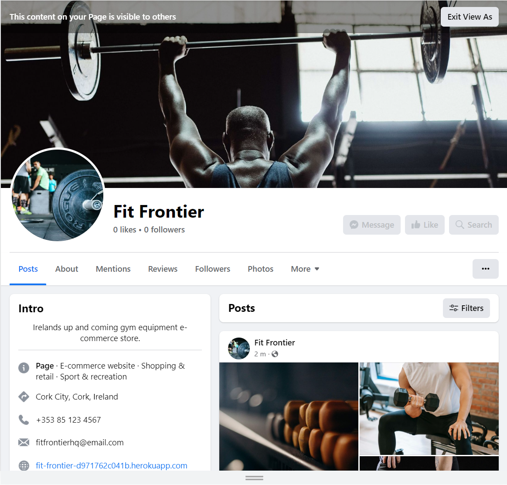

<h1 style="text-align: center;">Fit Frontier</h1>

Welcome to Fit Frontier. A full stack e-commerce website.

This project is created as part of my fifth and final project for a Diploma in Software Development with [Code Institue](https://codeinstitute.net/ie/).

[View the live project here.](https://codeinstitute.net)

<h2 style="text-align: center;"></h2>

# **Table of Contents**
   - [**User Experience**](#user-experience-ux)
      - [Site Goals](#site-goals)
      - [Features](#features)
   - [**Technologies Used**](#technologies-used)
   - [**Testing**](#testing)
   - [**SEO**](#search-engine-optimization-seo--social-media-marketing)
   - [**Deployment**](#deployment)
   - [**Credits & Acknowledgements**](#credits)

## User Experience (UX)

### Site Goals

 - #### Overview:
    Fit Frontier is an e-commerce platform specializing in the sale of gym equipment, including dumbbells, barbells, kettlebells, and weight plates. Our business model caters to both individual consumers (B2C) and businesses (B2B) looking to purchase high-quality fitness equipment. We aim to provide a seamless online shopping experience, offering a wide range of fitness products while prioritizing convenience, affordability, and customer satisfaction.

- ### User stories
   To help with the development of this project, I created user stories to map out tasks I needed to achieve in order to build the website to a good standard.
   
- ### Design

- #### Colour Scheme


- #### Typography


- #### Imagery


- ### Wireframes


Back to [top](#table-of-contents)

## Features

- Responsive on all device sizes

- Interactive elements

Back to [top](#table-of-contents)

## Technologies Used

### Languages, Frameworks & Other Dependecies Used

- [HTML5](https://en.wikipedia.org/wiki/HTML5) - Used for the main site content.
- [CSS3](https://en.wikipedia.org/wiki/Cascading_Style_Sheets) - Used for the main site design and layout.
- [Python](https://www.python.org/) - Used as the back-end programming language.
- [JavaScript](https://en.wikipedia.org/wiki/JavaScript) - Used for user interaction on the site.
- [Django 3.2.18](https://www.djangoproject.com/) - Free and open source Python Web Framework
- [Django Allauth](https://django-allauth.readthedocs.io/en/latest/) - Integrated set of Django applications addressing authentication and registration
- [Gunicorn 20.1.0](https://gunicorn.org/) - A Python WSGI HTTP server that compatible with Django and used to run the project on Heroku
- [ElephantSQL](https://www.elephantsql.com/) - A PostgreSQL database hosting service
- [Stripe](https://stripe.com/) - Provides a secure and convenient way to handle online payments
- [Amazon Web Services S3 Bucket](https://aws.amazon.com/s3/) - A cloud storage service which provides object storage, built for storing and recovering any amount of information or data from anywhere over the internet through a web services interface
- [Heroku](https://www.heroku.com) - A cloud platform as a service
- [Bootstrap](https://getbootstrap.com/) - A Framework for building responsive, mobile-fist sites

Back to [top](#table-of-contents)

## Testing

All testing information can be found in [TESTING.md](TESTING.md).

[Back to Top](#table-of-contents)

### Known Bugs

- In the edit shopping bag page. Updating the quantity of the item above the quantity of 1 works fine, however. I received errors when I try to change the item quantity to zero and remove the item that way.
 
 
The reason for this error was because I wrapped ‘item_id’ in square brackets. I needed to use parentheses to call it, not square brackets.


Back to [top](#table-of-contents)
 
## Search Engine Optimization (SEO) & Social Media Marketing

### Social Media Marketing

Building a robust social network with active participation and connecting it to your business website can lead to increased sales.

I've created a Facebook business account wich can be acessed **[here](https://www.facebook.com/profile.php?id=61550885970917)**.



Back to [top](#table-of-contents)


## Deployment

### ElephantSQL Database

This project uses [ElephantSQL](https://www.elephantsql.com) for the PostgreSQL Database.

To obtain your own Postgres Database, sign-up with your GitHub account, then follow these steps:
- Click **Create New Instance** to start a new database.
- Provide a name (this is commonly the name of the project: fit-frontier).
- Select the **Tiny Turtle (Free)** plan.
- You can leave the **Tags** blank.
- Select the **Region** and **Data Center** closest to you.
- Once created, click on the new database name, where you can view the database URL and Password.

Back to [top](#table-of-contents)

### Amazon AWS

This project uses [Amazon Web Service(AWS)](https://aws.amazon.com) to store media and static files online.

Once you've created an AWS account and logged-in, follow these series of steps to get your project connected.
Make sure you're on the **AWS Management Console** page.

Back to [top](#table-of-contents)

#### S3 Bucket

- Search for **S3**.
- Create a new bucket, give it a name (matching your Heroku app name), and choose the region closest to you.
- Uncheck **Block all public access**, and acknowledge that the bucket will be public (required for it to work on Heroku).
- From **Object Ownership**, make sure to have **ACLs enabled**, and **Bucket owner preferred** selected.
- From the **Properties** tab, turn on static website hosting, and type `index.html` and `error.html` in their respective fields, then click **Save**.
- From the **Permissions** tab, paste in the following CORS configuration:

 ```shell
	[
		{
			"AllowedHeaders": [
				"Authorization"
			],
			"AllowedMethods": [
				"GET"
			],
			"AllowedOrigins": [
				"*"
			],
			"ExposeHeaders": []
		}
	]
```

Back to [top](#table-of-contents)

- Copy your **ARN** string.
- From the **Bucket Policy** tab, select the **Policy Generator** link, and use the following steps:
	- Policy Type: **S3 Bucket Policy**
	- Effect: **Allow**
	- Principal: `*`
	- Actions: **GetObject**
	- Amazon Resource Name (ARN): **paste-your-ARN-here**
	- Click **Add Statement**
	- Click **Generate Policy**
	- Copy the Policy, and paste it into the **Bucket Policy Editor**


   ```shell
   {
      "Version": "2012-10-17",
      "Id": "Policy1234567890",
      "Statement": [
         {
               "Sid": "Stmt1693845683464",
               "Effect": "Allow",
               "Principal": "*",
               "Action": "s3:GetObject",
               "Resource": "arn:aws:s3:::your-bucket-name/*"
         }
      ]
   }
   ```
   - Before you click "Save", add `/*` to the end of the Resource key in the Bucket Policy Editor (like above).
	- Click **Save**.
- From the **Access Control List (ACL)** section, click "Edit" and enable **List** for **Everyone (public access)**, and accept the warning box.
	- If the edit button is disabled, you need to change the **Object Ownership** section above to **ACLs enabled** (mentioned above).


Back to [top](#table-of-contents)

#### IAM

Back on the AWS Services Menu, search for and open **IAM** (Identity and Access Management).
Once on the IAM page, follow these steps:

- From **User Groups**, click **Create New Group**.
	- Suggested Name: `group-fit-frontier` (group + the project name)
- Tags are optional, but you must click it to get to the **review policy** page.
- From **User Groups**, select your newly created group, and go to the **Permissions** tab.
- Open the **Add Permissions** dropdown, and click **Attach Policies**.
- Select the policy, then click **Add Permissions** at the bottom when finished.
- From the **JSON** tab, select the **Import Managed Policy** link.
	- Search for **S3**, select the `AmazonS3FullAccess` policy, and then **Import**.
	- You'll need your ARN from the S3 Bucket copied again, which is pasted into "Resources" key on the Policy.

		```shell
		{
			"Version": "2012-10-17",
			"Statement": [
				{
					"Effect": "Allow",
					"Action": "s3:*",
					"Resource": [
						"arn:aws:s3:::your-bucket-name",
						"arn:aws:s3:::your-bucket-name/*"
					]
				}
			]
		}
		```
	
	- Click **Review Policy**.
	- Suggested Name: `policy-fit-frontier` (policy + the project name)
	- Provide a description:
		- "Access to S3 Bucket for fit-frontier static files."
	- Click **Create Policy**.
- From **User Groups**, click your "group-fit-frontier".
- Click **Attach Policy**.
- Search for the policy you've just created ("policy-fit-frontier") and select it, then **Attach Policy**.
- From **User Groups**, click **Add User**.
	- Suggested Name: `user-fit-frontier` (user + the project name)
- For "Select AWS Access Type", select **Programmatic Access**.
- Select the group to add your new user to: `group-fit-frontier`
- Tags are optional, but you must click it to get to the **review user** page.
- Click **Create User** once done.
- You should see a button to **Download .csv**, so click it to save a copy on your system.
	- **IMPORTANT**: once you pass this page, you cannot come back to download it again, so do it immediately!
	- This contains the user's **Access key ID** and **Secret access key**.
	- `AWS_ACCESS_KEY_ID` = **Access key ID**
	- `AWS_SECRET_ACCESS_KEY` = **Secret access key**

Back to [top](#table-of-contents)

#### Final AWS Setup

- If Heroku Config Vars has `DISABLE_COLLECTSTATIC` still, this can be removed now, so that AWS will handle the static files.
- Back within **S3**, create a new folder called: `media`.
- Select any existing media images for your project to prepare them for being uploaded into the new folder.
- Under **Manage Public Permissions**, select **Grant public read access to this object(s)**.
- No further settings are required, so click **Upload**.

Back to [top](#table-of-contents)

### Stripe API

This project uses [Stripe](https://stripe.com) to handle the ecommerce payments.

Once you've created a Stripe account and logged-in, follow these series of steps to get your project connected.

- From your Stripe dashboard, click to expand the "Get your test API keys".
- You'll have two keys here:
	- `STRIPE_PUBLIC_KEY` = Publishable Key (starts with **pk**)
	- `STRIPE_SECRET_KEY` = Secret Key (starts with **sk**)

As a backup, in case users prematurely close the purchase-order page during payment, we can include Stripe Webhooks.

- From your Stripe dashboard, click **Developers**, and select **Webhooks**.
- From there, click **Add Endpoint**.
	- `https://fit-frontier-d971762c041b.herokuapp.com/checkout/wh/`
   
- Click **receive all events**.
- Click **Add Endpoint** to complete the process.
- You'll have a new key here:
	- `STRIPE_WH_SECRET` = Signing Secret (Wehbook) Key (starts with **wh**)

Back to [top](#table-of-contents)

### Heroku Deployment

This project uses [Heroku](https://www.heroku.com), a platform as a service (PaaS) that enables developers to build, run, and operate applications entirely in the cloud.

Deployment steps are as follows, after account setup:

- Select **New** in the top-right corner of your Heroku Dashboard, and select **Create new app** from the dropdown menu.
- Your app name must be unique, and then choose a region closest to you (EU or USA), and finally, select **Create App**.
- From the new app **Settings**, click **Reveal Config Vars**, and set your environment variables.

| Key | Value |
| --- | --- |
| `AWS_ACCESS_KEY_ID` | user's own value |
| `AWS_SECRET_ACCESS_KEY` | user's own value |
| `DATABASE_URL` | user's own value |
| `DISABLE_COLLECTSTATIC` | 1 (*this is temporary, and can be removed for the final deployment*) |
| `EMAIL_HOST_PASS` | user's own value |
| `EMAIL_HOST_USER` | user's own value |
| `SECRET_KEY` | user's own value |
| `STRIPE_PUBLIC_KEY` | user's own value |
| `STRIPE_SECRET_KEY` | user's own value |
| `STRIPE_WH_SECRET` | user's own value |
| `USE_AWS` | True |

Heroku needs two additional files in order to deploy properly.
- requirements.txt
- Procfile

You can install this project's **requirements** (where applicable) using:
- `pip3 install -r requirements.txt`

If you have your own packages that have been installed, then the requirements file needs updated using:
- `pip3 freeze --local > requirements.txt`

The **Procfile** can be created with the following command:
- `echo web: gunicorn app_name.wsgi > Procfile`
- *replace **app_name** with the name of your primary Django app name; the folder where settings.py is located*

For Heroku deployment, follow these steps to connect your own GitHub repository to the newly created app:

Either:
- Select **Automatic Deployment** from the Heroku app.

Or:
- In the Terminal/CLI, connect to Heroku using this command: `heroku login -i`
- Set the remote for Heroku: `heroku git:remote -a app_name` (replace *app_name* with your app name)
- After performing the standard Git `add`, `commit`, and `push` to GitHub, you can now type:
	- `git push heroku main`

The project should now be connected and deployed to Heroku!

Back to [top](#table-of-contents)

### Local Deployment

This project can be cloned or forked in order to make a local copy on your own system.

For either method, you will need to install any applicable packages found within the *requirements.txt* file.
- `pip3 install -r requirements.txt`.

You will need to create a new file called `env.py` at the root-level,
and include the same environment variables listed above from the Heroku deployment steps.

Sample `env.py` file:

```python
import os

os.environ.setdefault("AWS_ACCESS_KEY_ID", "user's own value")
os.environ.setdefault("AWS_SECRET_ACCESS_KEY", "user's own value")
os.environ.setdefault("DATABASE_URL", "user's own value")
os.environ.setdefault("EMAIL_HOST_PASS", "user's own value")
os.environ.setdefault("EMAIL_HOST_USER", "user's own value")
os.environ.setdefault("SECRET_KEY", "user's own value")
os.environ.setdefault("STRIPE_PUBLIC_KEY", "user's own value")
os.environ.setdefault("STRIPE_SECRET_KEY", "user's own value")
os.environ.setdefault("STRIPE_WH_SECRET", "user's own value")

# local environment only (do not include these in production/deployment!)
os.environ.setdefault("DEBUG", "True")
```

Once the project is cloned or forked, in order to run it locally, you'll need to follow these steps:
- Start the Django app: `python3 manage.py runserver`
- Stop the app once it's loaded: `CTRL+C` or `⌘+C` (Mac)
- Make any necessary migrations: `python3 manage.py makemigrations`
- Migrate the data to the database: `python3 manage.py migrate`
- Create a superuser: `python3 manage.py createsuperuser`
- Load fixtures (if applicable): `python3 manage.py loaddata file-name.json` (repeat for each file)
- Everything should be ready now, so run the Django app again: `python3 manage.py runserver`

If you'd like to backup your database models, use the following command for each model you'd like to create a fixture for:
- `python3 manage.py dumpdata your-model > your-model.json`
- *repeat this action for each model you wish to backup*

Back to [top](#table-of-contents)

#### Cloning

You can clone the repository by following these steps:

1. Go to the [GitHub repository](https://github.com/Mark-O-S/Fit-Frontier) 
2. Locate the Code button above the list of files and click it 
3. Select if you prefer to clone using HTTPS, SSH, or GitHub CLI and click the copy button to copy the URL to your clipboard
4. Open Git Bash or Terminal
5. Change the current working directory to the one where you want the cloned directory
6. In your IDE Terminal, type the following command to clone my repository:
	- `git clone https://github.com/Mark-O-S/Fit-Frontier.git`
7. Press Enter to create your local clone.

Alternatively, if using Gitpod, you can click below to create your own workspace using this repository.

[](https://gitpod.io/#https://github.com/Mark-O-S/Fit-Frontier)

Please note that in order to directly open the project in Gitpod, you need to have the browser extension installed.
A tutorial on how to do that can be found [here](https://www.gitpod.io/docs/configure/user-settings/browser-extension).


Back to [top](#table-of-contents)

#### Forking

By forking the GitHub Repository, we make a copy of the original repository on our GitHub account to view and/or make changes without affecting the original owner's repository.
You can fork this repository by using the following steps:

1. Log in to GitHub and locate the [GitHub Repository](https://github.com/Mark-O-S/Fit-Frontier)
2. At the top of the Repository (not top of page) just above the "Settings" Button on the menu, locate the "Fork" Button.
3. Once clicked, you should now have a copy of the original repository in your own GitHub account!

Back to [top](#table-of-contents)

### GitHub Pages

This project was developed in [CodeAnywhere](https://app.codeanywhere.com/) Cloud IDE using [Code Institute's Full Template](https://github.com/Code-Institute-Org/ci-full-template).

1. Log in to GitHub and locate the [GitHub Repository](https://github.com/)
2. At the top of the Repository (not top of page), locate the "Settings" Button on the menu.
   - Alternatively Click [Here](https://raw.githubusercontent.com/) for a GIF demonstrating the process starting from Step 2.
3. Scroll down the Settings page until you locate the "GitHub Pages" Section.
4. Under "Source", click the dropdown called "None" and select "Master Branch".
5. The page will automatically refresh.
6. Scroll back down through the page to locate the now published site [link](https://github.com) in the "GitHub Pages" section.

Back to [top](#table-of-contents)

### Forking the GitHub Repository

By forking the GitHub Repository we make a copy of the original repository on our GitHub account to view and/or make changes without affecting the original repository by using the following steps...

1. Log in to GitHub and locate the [GitHub Repository](https://github.com/)
2. At the top of the Repository (not top of page) just above the "Settings" Button on the menu, locate the "Fork" Button.
3. You should now have a copy of the original repository in your GitHub account.

Back to [top](#table-of-contents)

### Making a Local Clone

1. Log in to GitHub and locate the [GitHub Repository](https://github.com/)
2. Under the repository name, click "Clone or download".
3. To clone the repository using HTTPS, under "Clone with HTTPS", copy the link.
4. Open Git Bash
5. Change the current working directory to the location where you want the cloned directory to be made.
6. Type `git clone`, and then paste the URL you copied in Step 3.

```
git clone https://github.com/YOUR-USERNAME/YOUR-REPOSITORY
```

7. Press Enter. Your local clone will be created.

```
$ git clone https://github.com/YOUR-USERNAME/YOUR-REPOSITORY
> Cloning into `CI-Clone`...
> remote: Counting objects: 10, done.
> remote: Compressing objects: 100% (8/8), done.
> remove: Total 10 (delta 1), reused 10 (delta 1)
> Unpacking objects: 100% (10/10), done.
```

Click [Here](https://help.github.com/en/github/creating-cloning-and-archiving-repositories/cloning-a-repository#cloning-a-repository-to-github-desktop) to retrieve pictures for some of the buttons and more detailed explanations of the above process.

Back to [top](#table-of-contents)

## Credits

### Code

- The full-screen hero image code came from this [StackOverflow post](https://stackoverflow.com)

- [Bootstrap4](https://getbootstrap.com/docs/4.4/getting-started/introduction/): Bootstrap Library used throughout the project mainly to make site responsive using the Bootstrap Grid System.

- [MDN Web Docs](https://developer.mozilla.org/) : For Pattern Validation code. Code was modified to better fit my needs and to match an Irish phone number layout to ensure correct validation. Tutorial Found [Here](https://developer.mozilla.org/en-US/docs/Web/HTML/Element/input/tel#Pattern_validation)

Back to [top](#table-of-contents)

### Content

- All content was written by the developer.

- Psychological properties of colours text in the README.md was found [here](http://www.colour-affects.co.uk/psychological-properties-of-colours)

Back to [top](#table-of-contents)

### Media

- All Images were created by the developer.

Back to [top](#table-of-contents)

### Acknowledgements

- My Mentor for continuous helpful feedback.

- Tutor support at Code Institute for their support.

Back to [top](#table-of-contents)
