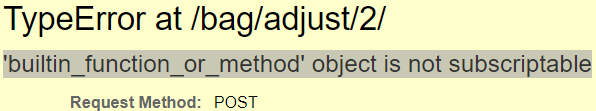
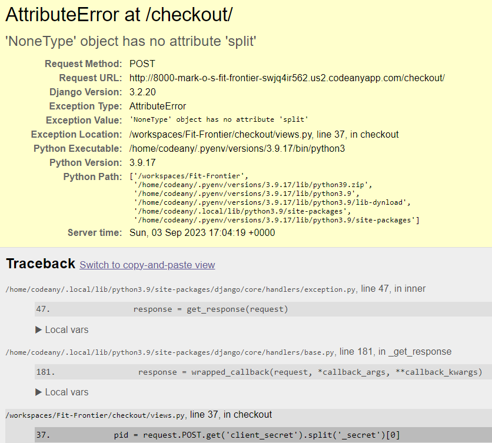
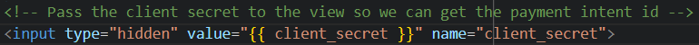

[Back to README](README.md)
## User Stories

    
<b>Click for User Stories</b>

    
 
        The goal of this test is to ensure that the user requirements have been delivered. Further details of features and user story tasks can be found in: <em><strong>https://github.com/users/Mark-O-S/projects/6</strong></em>. 

| No: | User Story | Acceptance Criteria | Result | Additional Comments |
|-----|------------|---------------------|--------|-----------|
| 1 | As a site user, I can gain access to the website so that I can learn more about the business and the types of products they sell. | - Website URL directs user to the homepage.   - The landing page has a clear overview of what the goals of the website.  | Pass |  |
| 2 | As a site user, I can easily navigate around the website. | - Navigation bar is present across all pages of the website.   - Links to other pages work when trying to navigate the website.   - Hamburger dropdown menu displayed in smaller screens.  | Pass | Profile page only accessible by registered users. |
| 3 | As a site user, I want to be able to find more information about the business, contact the business and/or follow the creator. | - Footer section is displayed at the bottom of the page across the website.   - Contact details and social links are clearly displayed.   - Links to pages outside of the website opens in a new tab.  | Pass | Ensured that a newsletter signup is also included. |
| 4 | As a business owner, add a Call To Action button that is clearly visible on the landing page to encourage site users to access the shop and view/buy products. |  - Include a Hero Image.   - Add a "Shop Now" button as a Call To Action to site users. | Pass | |
| 5 | As a site user, I can read about the business for more details. | Include an "About" page and display clearly.  | Pass |  |
| 6 | As a business owner, include all product categories in the landing page for easier UI/UX and navigation. | - Easily display each category with an image and button.   - Ensure each category product that is clicked will lead to the correct page.   - Allow users the option to either click the product category image or the button to be redirected to the chosen page.  | Pass |  |
| 7 | As a site user, I can register for an account so that I have access to additional features of the website. | - Enable a site user to register for an account using email, username and password.  | Pass |  |
| 8 | As a site user, I can check my emails for a confirmation email in order to verify that my registration is successful. | - The user is asked to verify their email address upon registration.  | Pass | |
| 9 | As a site user, I can login and logout from my account, so that I can access my account’s information and keep my information secure. | - The user is able to login to their account using their username and password.   - User is able to logout from their account.  | Pass |  |
| 10 | As a site user, I can reset my password so that I can regain access to my account if I forget my username and/or password. | -The user is able to reset their password by entering their email address.   - The user receives an email with a link redirecting them to reset their password. | Pass | |
| 11 | As a business owner, I can have access to the admin interface to add, update, view and delete products. | - Enable admin the ability to add, update, view and delete categories in the admin panel.   - Enable admin the ability to add products and their relative information and images via the admin panel.| Pass |  |
| 12 | As a business owner, I can add a product through the store user interface in order to add new items to my store. | - Enable business owner to add products to the store via form on the frontend. | Fail | Not completed. For now, this can only be done through the admin interface. |
| 13 | As a business owner, I can edit/update a product through store user interface  | - Enable business owner to update products via form on the frontend.  | Fail | Not completed. For now, this can only be done through the admin interface. |
| 14 | As a Customer, I can view the sites products so that I can make a purchase. | - Enable site users to see a list of products in the Shop page.   - Each product displays an image, name, price, category & rating.   - Enable site users to view a specific category of products.   - Enable site users to quickly identify deals and new products. | Pass |  |
| 15 | As a Customer, I can view individual product descriptions so that I can get more information. | - Enable site users to click on each individual product to get more information.   - Enable site users to see any reviews made on each specific product, or if user is registered. Allow them to create, edit or delete their review.| Pass |  |
| 16 | As a Customer, I can search for a specific product through the search tab to quickly find a certain product. | - Enable site users to search for a product by name.   - Enable site users to see what they searched for and the number of results. | Pass |  |
| 17 | As a Customer, I can sort products to identify best rated and price ranging from high to low. | - Site users can sort all products as well as categories of products in ascending and descending order.   - Site users can sort products by price in ascending and descending order.   - Site users can sort products by rating in ascending and descending order.   - Site users can sort products by name in ascending and descending order. | Pass |  |
| 18 | As a registered user, I can have a personal profile when I'm using the site. | - Registered users are able to access their profile through logging in.   - Enable registered users the option to logout from the site. | Pass |  |
| 19 | As a customer, I can access my basket to review my items before I purchase them. | - Customer is able to access the basket page via the main navigation.   - Customers who have added products to their basket will be able to see their products. | Pass |  |
| 20 | As a customer, I can see the total cost of the products that I have in my basket so that I know how much I am going to be spending. | - Enable site users to add items to their basket.   - Enable site users to view the subtotal and total cost of items in their basket. | Pass |  |
| 21 | As a Customer, I can update the quantity of each item in my basket, so that I can easily make changes to my order before checkout. | - Enable site users to update the quantity of each item in their basket.   - Enable customer to easily remove a product from their basket if they wish. | Pass |  |
| 22 | As a developer, I can use Stripe to setup a secure payment system to the online shop. | - Ensure Stripe Elements work as expected.   - Ensure payment field requires a card number, expiration date and cvc.   - Invalid card number turns red and error message is displayed if details are invalid. | Pass |  |
| 23 | As a customer, I can see an order confirmation after checkout so that I can confirm that my order was successful. | - Enable customers to see their products and totals in the checkout page.   - Redirect customer to the checkout success page where they can see their order summary. | Pass |  |
| 24 | As a site user, I can sign up to the websites newsletter to can keep updated with the latest news and offers. | - Set up a newsletter email signup form and display it in the footer section.   - When a site user enters email and clicks subscribe, a success message is displayed.   - Email address is recorded on the Mailchimp account. | Pass |  |
                          
 

 

[Back to top](<#top>)

## Validation
Test to check that features and links are working as expected.

   
Lighthouse Validation

   - Overall, I am happy with the performance of the website according to the Lighthouse tool.

   
   
   
   
   

[Back to top](<#top>)

   
HTML Validation

   HTML was tested by using [W3C HTML Validation tool](https://validator.w3.org/), no errors were found, just warnings.

[W3C Validator](https://validator.w3.org/) was used in testing html.

Home Page

About Page

Products Page

Product Detail Page

Bag page

Checkout Page

Checkout Success Page

Profile Page

Signup Page

Login Page

Logout Page

Error Page

[Back to top](<#top>)

   
CSS Validation

   CSS code was tested by using the [W3C CSS Validation Tool](https://jigsaw.w3.org/css-validator/#validate_by_input). No errors were found.

   

[Back to top](<#top>)

   
Page Validation

   

   

## Known Bugs

1. In the edit shopping bag page. Updating the quantity of the item above the quantity of 1 works fine, however. I received errors when I try to change the item quantity to zero and remove the item that way.

   
   

- The reason for this error was because I wrapped ‘item_id’ in square brackets. I needed to use parentheses to call it, not square brackets.

   

2. In views.py for checkout, when we are checking if the order form is valid, an error was raised since the client secret was None and couldn’t split the value.

   

   

- The fix for this was add the missing input html tag which passes the client secret in the GET request to the views function.

   

3.	When the user searches for a product, the raw Django template variable parser ‘{{ search_term }}’was being displayed instead of the search query value.

   

   

- This happened because the prettier auto moved some of the html to the next line including the last two of the braces. This meant the Django template variable wasn’t getting parsed properly and was treated as a text value.

   

4. After deploying the project on Heroku and connected my AWS bucket, static files and media files. When I load up the website, the images were not displaying.
I was unable to find out what was causing the issue why the deployed site was not displaying images until I checked Django admin and clicked on the link of a product photo and it displayed an error message:

   

- Initially, the key “media/ barbell-metis-7ft-olympic-barbell-20kg_xCHE6az.jpg” did not have “_Xche6Az”. It should have been just 
“media/ barbell-metis-7ft-olympic-barbell-20kg”. I checked the rest of the images and realised that my media had duplicate copies which had extra letters and digits:

   

- I think that this happened when I dumped my database into a json file, it added extra characters to the img key. I removed the extra characters and 
removed duplicate files:

   

- After doing this the images loaded into the deployed site. I’m still not sure exactly how or why this occurred.

5.	Having issue after setting up real email confirmation with Django:

- I set debug mode to true to find more information of the error. Tried to register a new user with email and the following showed up:

   

- I searched to find django.core.mail.backends.smpt and finally realized that there was a typo. It should be django.core.mail.backends.smtp instead.

- I changed the typo:

   

- To correct smtp:
   
   
